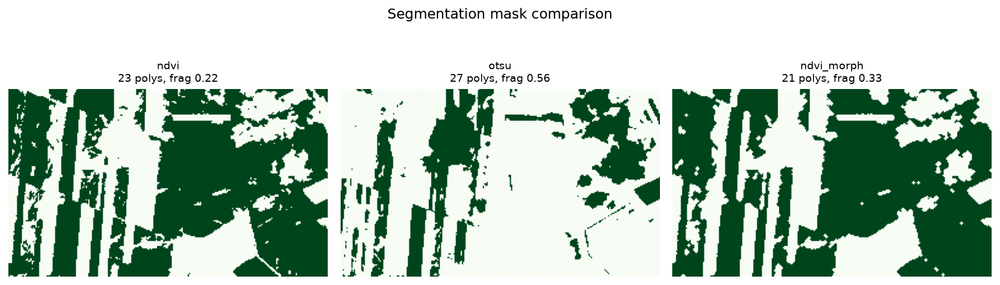
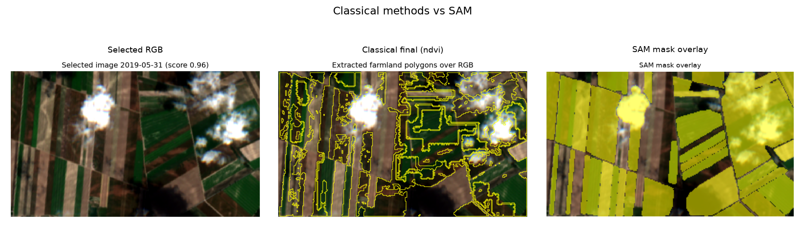

# Reproducible Sentinel-2 Farmland Boundary Extraction with Objective Best-Image Selection and a Classical-vs-Foundation-Model Segmentation Comparison

**Student:** Sina Ahmadi
**Context:** Interdisciplinary Project — Earth Observation / Data Science
**Date:** 29 June 2026
**Repository:** https://github.com/sinaaat/interdisciplinary_project

---

## 1. Abstract

This project builds the optical front-end of a larger Earth-observation workflow: given a region of
interest and a date range, it retrieves Sentinel-2 imagery from Google Earth Engine, picks the
clearest acquisition automatically, and turns it into georeferenced farmland-boundary polygons. Three
lightweight classical segmentation methods (NDVI thresholding, Otsu thresholding, and an
NDVI + morphology refinement with watershed splitting) are compared against SAM (Segment Anything), a
general-purpose foundation segmentation model used here as an advanced comparator. Because no
ground-truth parcel boundaries were available, the evaluation relies on measurable proxy metrics and
on pairwise agreement between methods rather than on supervised accuracy. The NDVI workflow was kept
as the delivered method; SAM was retained as an experimental point of comparison. The headline finding
is deliberately undramatic and useful: a large generic model did not beat a simple vegetation index on
this task, and the reasons why are exactly the kind of trade-off a data scientist is expected to
reason about.

## 2. Introduction

Satellite imagery on its own is not an answer to anything — it is a stack of pixels. Before any
agronomic or geophysical question can be asked about a field, the field itself has to be located and
turned into a discrete object with a boundary, an area, and a coordinate system. That conversion, from
raw reflectance to structured geospatial features, is the part of the pipeline this project
implements. It sits at the intersection of remote sensing, image processing, and software engineering,
which is what makes it an interdisciplinary data-science problem rather than a pure modelling exercise.

## 3. Interdisciplinary motivation

The work touches several disciplines at once. Remote sensing supplies the physics of why NDVI
separates vegetation from bare soil. Image processing supplies the thresholding, morphology, and
watershed steps. Software engineering supplies the configuration, reproducibility, and packaging that
let the whole thing run with a single command. The data-science contribution is the glue: deciding how
to score image quality, which segmentation method to trust, what to measure when there is no ground
truth, and how to package the result so a downstream consumer can use it without reverse-engineering
the pipeline. None of those decisions are settled by the model alone.

## 4. Problem statement and scope

The implemented scope is the **optical Sentinel-2 retrieval and farmland-polygon extraction stage**.
Given user coordinates, a start date, an end date, and a time step, the system produces a validated set
of farmland boundary polygons derived from the best available image in that interval, together with a
defensible comparison of the segmentation methods used to produce them.

What is explicitly **not** implemented: SAR / Sentinel-1 retrieval, backscatter analysis, calibrated
soil-surface roughness, and any temporal roughness inversion. Those belong to a downstream stage and
are treated here only as future work that the polygon output is designed to feed.

## 5. Data source and study setup

Imagery comes from the `COPERNICUS/S2_HARMONIZED` collection through the Google Earth Engine Python
API. The region of interest is a roughly 2.3 km × 1.5 km block of agricultural land east of Vienna,
Austria, defined by four corner coordinates in the configuration file. The analysis interval runs from
1 April 2019 to 1 September 2019 and is split into 30-day windows. For each window the least-cloudy
scene is exported as a four-band GeoTIFF holding red, green, blue, and near-infrared (`B4, B3, B2, B8`)
at 10 m resolution. Keeping the NIR band is what makes NDVI possible while still allowing an RGB
preview. Six windows produced six candidate observations.

## 6. Image retrieval and quality scoring

Rather than choosing an image by eye, the pipeline scores every retrieved observation and ranks them.
The score combines four normalised components — low cloud cover, high valid-pixel coverage, a usable
vegetation signal, and reasonable scene contrast:

```
quality_score = 0.45·cloud_score + 0.25·valid_pixel_score + 0.15·vegetation_score + 0.15·contrast_score
```

The weighting puts most of the emphasis on cloud and coverage, then rewards images where vegetation is
actually visible. The full ranking is saved to `image_quality_scores.csv`. The clear winner was the
late-spring window:

| Field | Value |
|---|---|
| Selected window | 2019-05-31 → 2019-06-30 |
| Image ID | `COPERNICUS/S2_HARMONIZED/20190625T100039_20190625T100216_T33UXP` |
| Cloud cover | 0.75 % |
| Vegetation fraction | 0.80 |
| Quality score | **0.963** (highest of 6) |

## 7. Methodology

Four segmentation methods were run on the selected image:

- **NDVI threshold** — computes `(B8 − B4) / (B8 + B4)` and keeps pixels above a vegetation threshold.
  This is the most physically motivated method: it directly uses the red/NIR contrast that separates
  growing crops from soil.
- **Otsu threshold** — automatic grayscale thresholding on the RGB composite. A reasonable baseline,
  but blind to the vegetation signal.
- **NDVI + morphology** — the NDVI mask cleaned with morphological closing and small-component
  removal. This is the refinement step.
- **SAM (Segment Anything)** — run through its automatic mask generator. SAM's masks are filtered to
  drop the background-scale segment and tiny fragments, then written to a labeled raster aligned with
  the GeoTIFF so it can be vectorized through the same code path as the classical methods.

For the classical methods, a distance-transform watershed splits merged blobs before vectorization.
SAM produces instance-like masks directly. Every method ends in the same place: GeoJSON polygons in
EPSG:4326.

## 8. Evaluation design

There were no reference parcel boundaries for this region, so the project does not report supervised
IoU and does not pretend to. The evaluation instead uses two honest categories of metric.

| Category | Metrics | What it tells you |
|---|---|---|
| Real measured | cloud %, valid-pixel ratio, vegetation fraction, quality score, coverage %, polygon count, area (m²), runtime, geometry validity | Directly computed from the data / real inference |
| Proxy quality | fragmentation score, edge density, valid-polygon % | Describes the *structure* of a result, not its correctness |
| Method agreement | pairwise mask IoU | How much two automatic methods agree — **not** accuracy |
| Not reported | ground-truth IoU, calibrated roughness, SAR backscatter | No reference data / out of scope |

For a course project at this stage, proxy and agreement metrics are the defensible choice: they are
fully reproducible, they expose real differences between methods, and they do not dress up an
unvalidated result as if it had been checked against truth.

## 9. Results

**Image-quality ranking (6 windows):**

| Rank | Window | Cloud % | Vegetation frac | Quality score |
|---|---|---|---|---|
| 1 | 2019-05-31 → 2019-06-30 | 0.75 | 0.80 | **0.963** |
| 2 | 2019-07-30 → 2019-08-29 | 1.79 | 0.65 | 0.939 |
| 3 | 2019-06-30 → 2019-07-30 | 0.00 | 0.82 | 0.908 |
| 4 | 2019-08-29 → 2019-09-01 | 0.68 | 0.58 | 0.877 |
| 5 | 2019-04-01 → 2019-05-01 | 0.00 | 0.43 | 0.851 |
| 6 | 2019-05-01 → 2019-05-31 | 2.54 | 0.50 | 0.824 |

**Segmentation / model comparison (on the selected image):**

| Method | Coverage % | Polygons | Median area (m²) | Fragmentation | Valid % | Runtime (s) | Role |
|---|---|---|---|---|---|---|---|
| ndvi | 59.9 | 23 | 26,100 | 0.22 | 82.6 | 0.14 | classical (final) |
| otsu | 24.3 | 27 | 10,000 | 0.56 | 92.6 | 0.08 | classical |
| ndvi_morph | 61.2 | 21 | 32,300 | 0.33 | 90.5 | 0.06 | classical |
| sam | 70.1 | 33 | 48,300 | 0.00 | 100.0 | 214.1 | experimental |

**Pairwise mask IoU (method agreement):**

| | ndvi | otsu | ndvi_morph | sam |
|---|---|---|---|---|
| ndvi | — | 0.05 | 0.97 | 0.55 |
| otsu | 0.05 | — | 0.06 | 0.20 |
| ndvi_morph | 0.97 | 0.06 | — | 0.55 |
| sam | 0.55 | 0.20 | 0.55 | — |

**Final polygon output:**

| Output | Path | Features | CRS | Validity | Role |
|---|---|---|---|---|---|
| Classical farmland polygons | `outputs/vectors/farmland_polygons.geojson` | 18 | EPSG:4326 | 100 % valid | **delivered** |
| SAM polygons | `outputs/vectors/sam/sam_polygons.geojson` | 33 | EPSG:4326 | 100 % valid | experimental |

Both layers carry per-field attributes (`field_id`, `area_m2`, `pixel_count`, `segmentation_method`,
`source_window`, `source_image_id`, `image_quality_score`).

## 10. Visual results

The figures below are generated by the pipeline and stored under `outputs/figures/` and
`outputs/images/`.

Ranked contact sheet of all six retrieved images:


Selected best image and the image-quality ranking:


Classical segmentation masks side by side:



Classical NDVI polygons next to the SAM mask, and the full method comparison:




Final classical farmland polygons over the selected image, and their area distribution:


## 11. Discussion

The most interesting result is the one that looks, at first, like SAM winning. SAM produced the
cleanest geometry of any method — 70 % coverage, no small fragments, every polygon topologically valid.
Taken alone, those numbers flatter it. But its agreement with the NDVI result was only 0.55, and the
reason matters: SAM is a generic segmenter. It carves the whole scene into tidy regions regardless of
what is growing there, so its "fields" include bare-soil parcels, tracks, and other blocks that NDVI
deliberately leaves out. Clean geometry is not the same as farmland-specific correctness.

The two NDVI variants, by contrast, agreed almost perfectly (IoU 0.97), which is the expected and
reassuring outcome: morphological refinement tidied the mask without changing what it was looking at.
Otsu agreed with essentially nothing (0.05–0.06) and was the most fragmented method, consistent with a
grayscale threshold latching onto brightness rather than vegetation.

Cost sealed the decision. SAM took 214 seconds on CPU against NDVI's 0.14, and it needs a 2.4 GB model
checkpoint to run at all. For a 10 m image where the vegetation signal is already cleanly available in
the NIR band, paying three orders of magnitude more time and a multi-gigabyte dependency to get a
less task-specific result is not a good trade.

So although SAM produced geometrically valid segments and showed that a foundation segmentation model
is feasible here, it was slower and less task-specific than the NDVI-based workflow. The NDVI/watershed
pipeline stayed as the final method because it directly exploits the spectral vegetation signal in the
Sentinel-2 RGB/NIR data and produces farmland-oriented polygons that fit the downstream use case. That
is the data-science lesson worth taking from this project: choosing a model is not about reaching for
the largest one, but about matching the method to the data resolution, the domain signal, the task
objective, the runtime budget, and how the output will actually be used.

## 12. Limitations

- Sentinel-2 resolution is 10 m, so boundaries follow pixel edges and small features are lost.
- There were no external parcel boundaries, so no supervised IoU is reported; all metrics are proxy or
  agreement metrics.
- The thresholds, watershed parameters, and quality-score weights are sensible heuristics, not values
  tuned against ground truth.
- The selected scene contains a few small clouds inside the ROI even though its tile-level cloud
  metadata is low; NDVI excludes those pixels, but it is an honest weakness of tile-level scoring.
- SAM depends on a large checkpoint and is slow on CPU; it was run once for the comparison.
- The reference run covers a single ROI and a single five-month interval.

## 13. Future work

- Bring in external reference parcels (for example the Austrian INVEKOS dataset) to compute a real
  supervised IoU.
- Feed the polygons into the originally intended downstream stage: per-field Sentinel-1 SAR backscatter
  extraction as a proxy for soil-surface roughness change.
- Evaluate across multiple regions and seasons rather than one ROI.
- If labelled masks become available, train or fine-tune a supervised segmentation model, or prompt SAM
  with NDVI-derived seed points instead of a blind grid.

## 14. Conclusion

The project delivers a working, reproducible optical pipeline: it retrieves Sentinel-2 imagery for a
user-defined area and period, selects the clearest image by an objective score, compares three
classical segmentation methods against a foundation model with measurable metrics, and exports 18
validated farmland polygons in EPSG:4326, alongside 33 experimental SAM polygons. The classical NDVI
method was chosen as the delivered output for clear, defensible reasons rather than by default. The
result is a clean, attribute-rich field-boundary layer and an honest method comparison — exactly the
optical stage a downstream SAR-based roughness study would need to build on.
