# Visual Output Index

Quick visual inspection of the Sentinel-2 farmland boundary extraction deliverable, now including the
optional **SAM** advanced comparator. Open this file in any Markdown viewer to browse every figure and
image. All numbers come from the actual pipeline run (ROI near Vienna, 2019-04-01 → 2019-09-01, 30-day
step, 6 retrieved windows, `--include-sam`).

---

## 1. Selected best image

Chosen automatically by quality score. **Window `2019-05-31 … 2019-06-30` — quality 0.963, cloud 0.7%.**

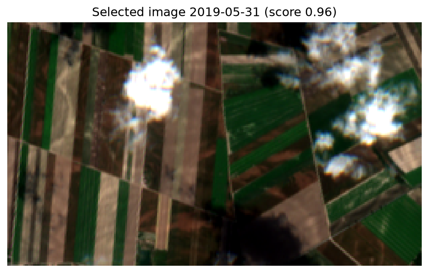

---

## 2. The 6 retrieved RGB images (ranked by quality)

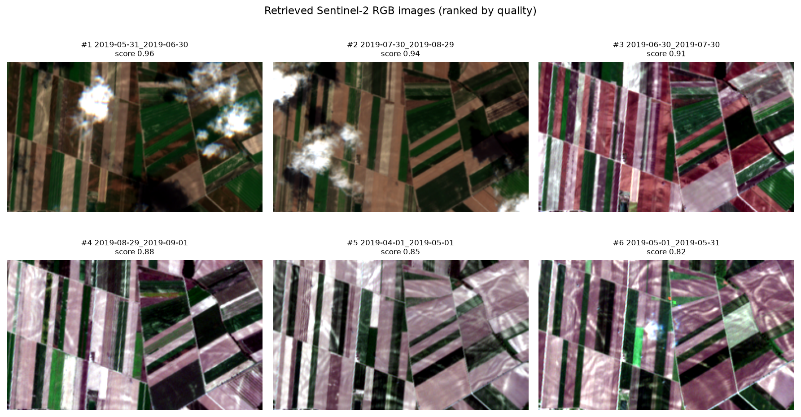

| Rank | Window | Preview |
|---|---|---|
| 1 | 2019-05-31_2019-06-30 | 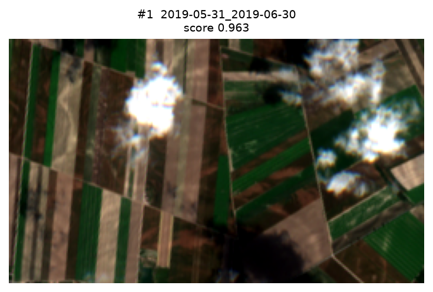 |
| 2 | 2019-07-30_2019-08-29 | 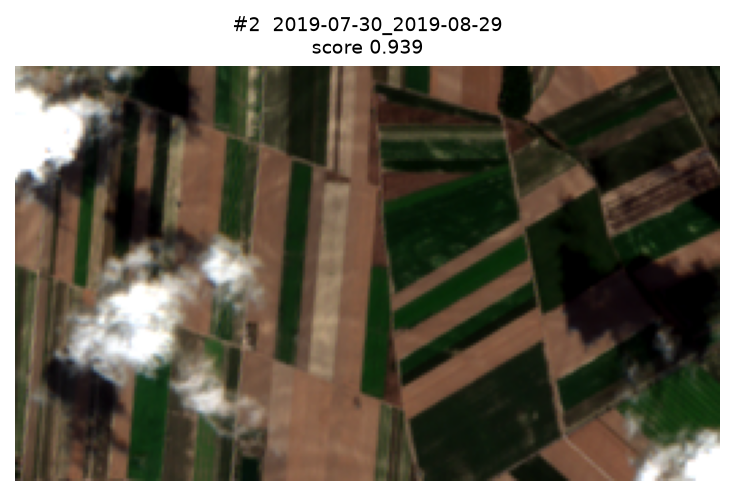 |
| 3 | 2019-06-30_2019-07-30 | 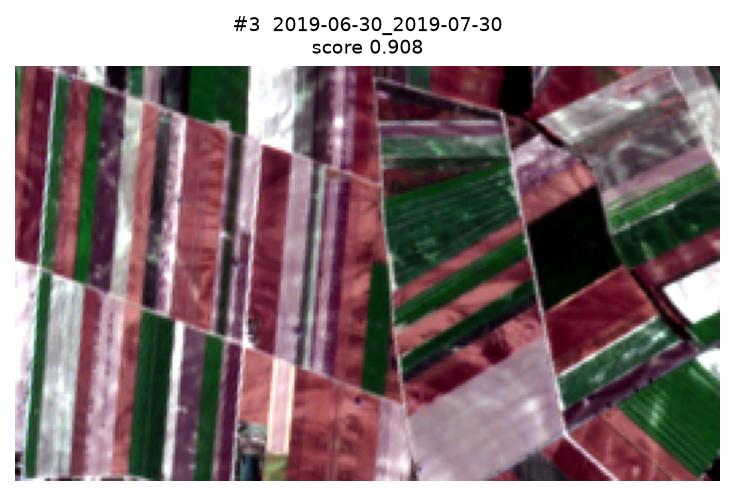 |
| 4 | 2019-08-29_2019-09-01 | 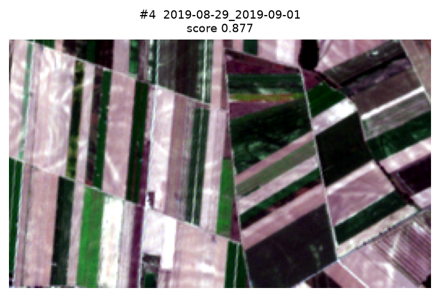 |
| 5 | 2019-04-01_2019-05-01 | 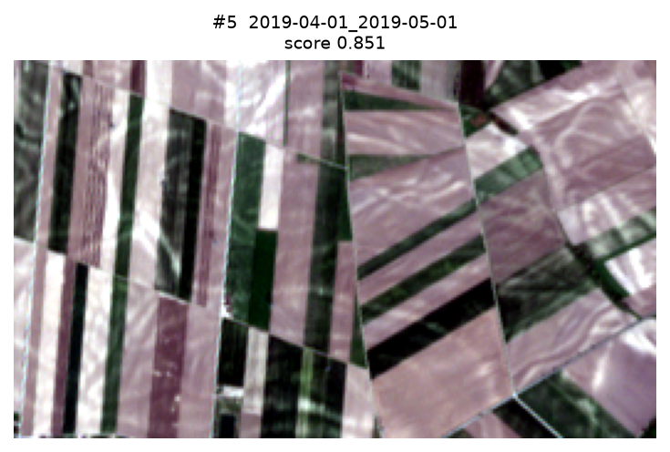 |
| 6 | 2019-05-01_2019-05-31 | 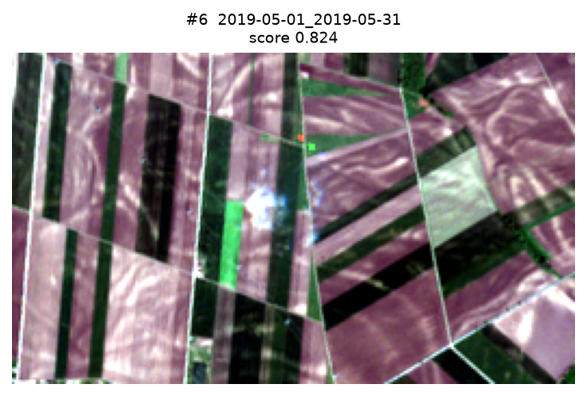 |

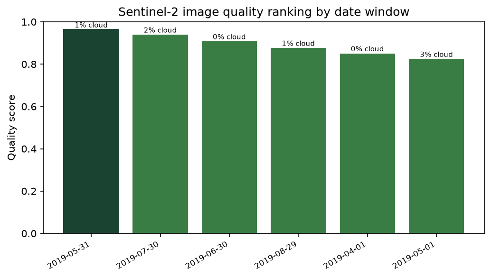

---

## 3. Classical segmentation methods

| NDVI | Otsu | NDVI + morphology |
|---|---|---|
| 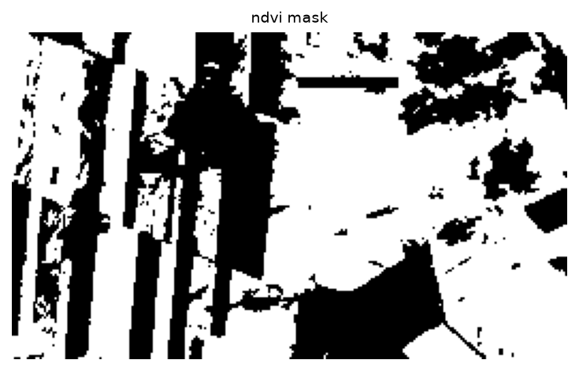 | 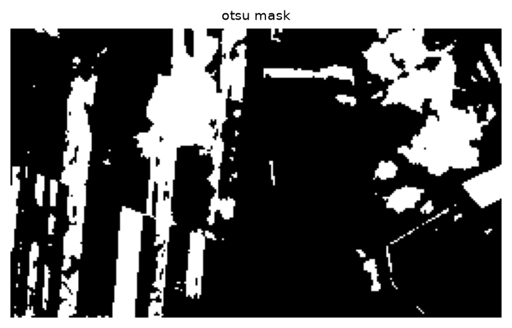 |  |
|  | 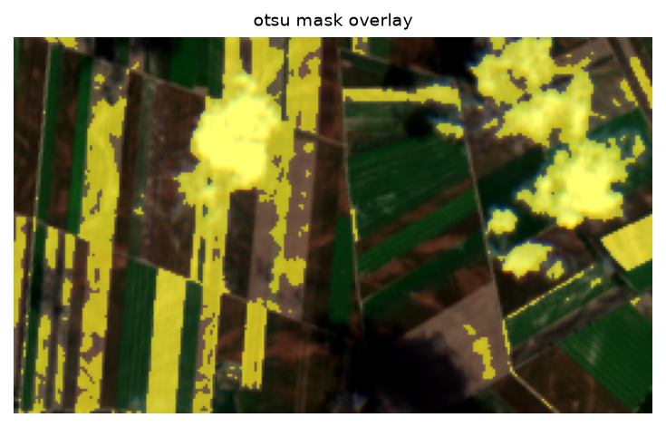 | 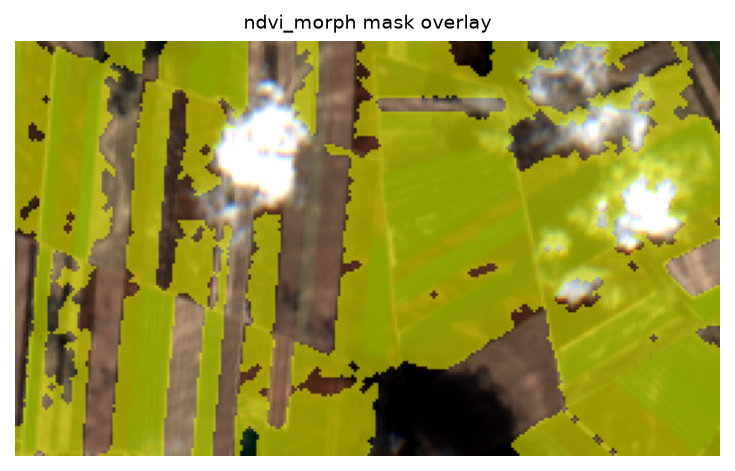 |

---

## 4. SAM (Segment Anything) advanced comparator

SAM mask and overlays on the selected image (experimental comparator, not the final method):

| SAM binary mask | SAM mask overlay | SAM polygon overlay |
|---|---|---|
| 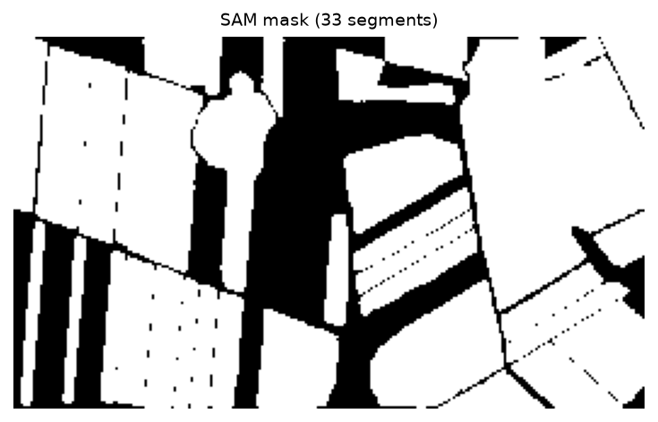 | 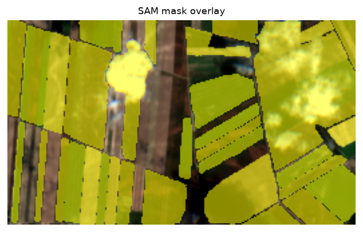 | 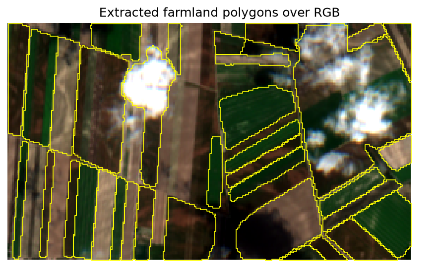 |

---

## 5. Classical vs SAM comparison

Side-by-side: selected RGB, classical NDVI final polygons, and SAM mask. SAM segments the whole scene
(including non-vegetated parcels), so it covers more area but is not farmland-specific.

Extended metric comparison and method agreement:

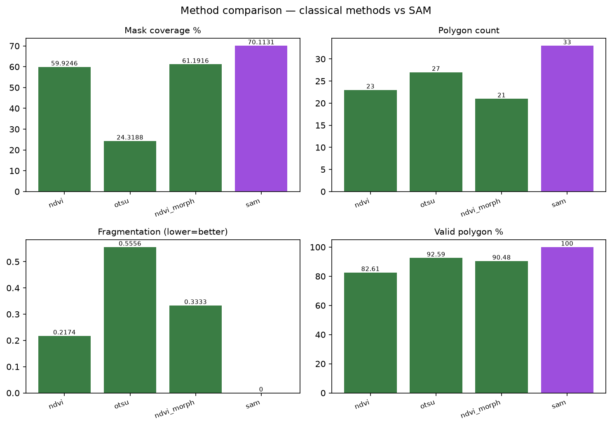

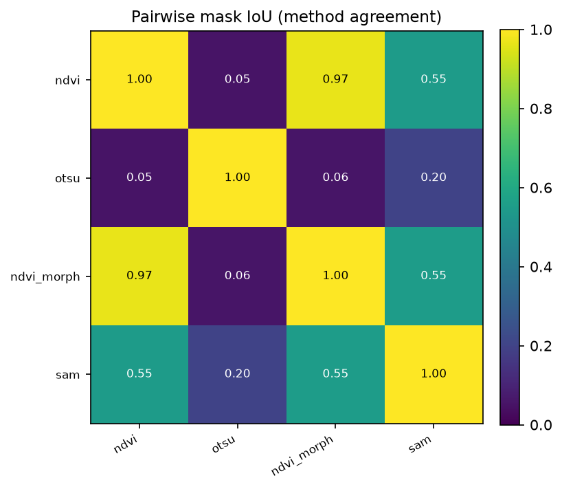

### Extended comparison table

| method | coverage % | polygons | fragmentation | valid % | runtime s | role |
|---|---|---|---|---|---|---|
| ndvi (final) | 59.9 | 23 | 0.22 | 82.6 | 0.14 | classical_final |
| otsu | 24.3 | 27 | 0.56 | 92.6 | 0.08 | classical |
| ndvi_morph | 61.2 | 21 | 0.33 | 90.5 | 0.06 | classical |
| sam | 70.1 | 33 | 0.00 | 100.0 | 214.1 | sam_experimental |

Pairwise mask IoU: ndvi~ndvi_morph 0.97; ndvi~sam 0.55; ndvi_morph~sam 0.55; otsu~sam 0.20;
ndvi~otsu 0.05.

---

## 6. Final farmland polygons

**Delivered (classical NDVI):** 18 validated polygons (100% valid), `farmland_polygons.geojson`.
**SAM experimental:** 33 validated polygons, `sam_polygons.geojson`.

Classical polygon overlay and area distribution:

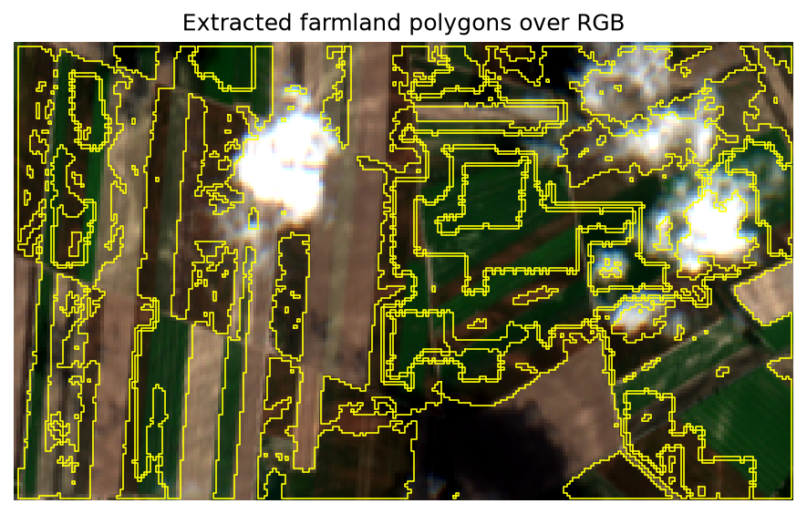

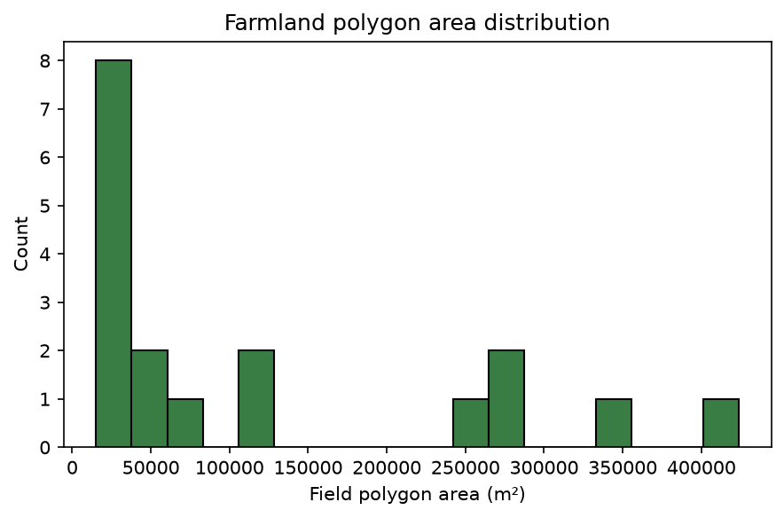

---

## 7. What each output means

- **Retrieved RGB images** — one least-cloudy Sentinel-2 observation per window, stretched for display.
- **Quality ranking** — objective visibility scores used to pick the image to segment.
- **Classical masks/overlays** — each classical method's field decision on the selected image.
- **SAM mask/overlays** — the foundation model's generic segmentation of the same image.
- **Comparison figures/tables** — measurable proxy metrics + method agreement (mask IoU), not
  supervised accuracy.
- **Final polygons** — the delivered classical farmland layer (NDVI) plus SAM's experimental polygons,
  both georeferenced and valid; ready for downstream Earth-observation analysis.
